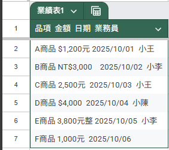
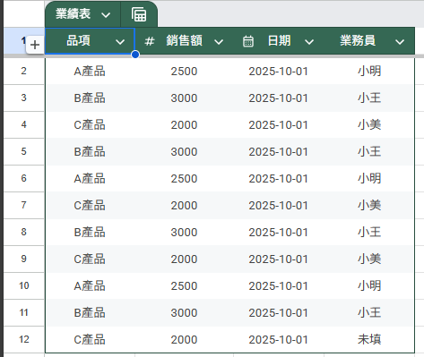
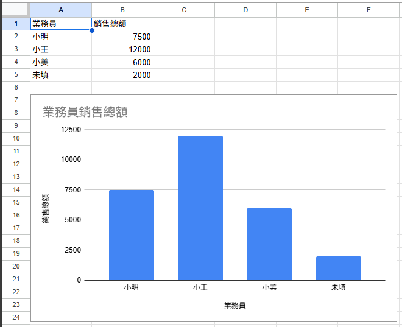
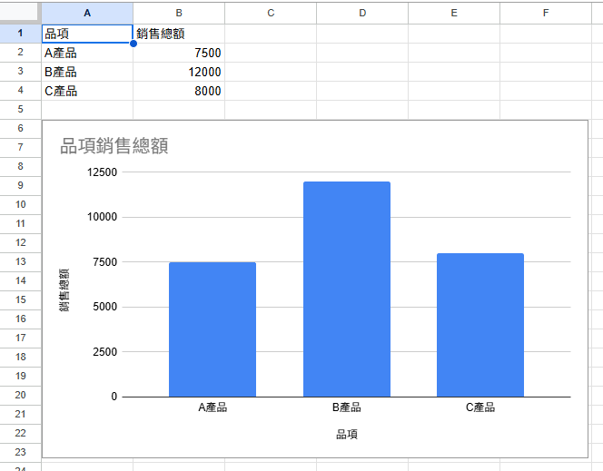

# Sales Report Automation 專案

## 測試資料下載

你可以在 [`資料清理.xlsx`](資料清理.xlsx) 中找到原始資料與清理後資料，包含：

- 工作表「原始資料(未清理)」：混亂格式的金額欄位與業務員資料
- 工作表「原始資料(清理後)」：已清理為純數字格式，適合報表統計

## 專案背景
本專案旨在協助行政／業務單位自動化銷售報表流程，減少人工操作、提升資料一致性與報表效率。

## 專案目標
- 自動清理原始資料格式（如金額欄位）
- 快速統計業務員與品項銷售總額
- 自動產出報表與長條圖
- 整合為一鍵執行模組，提升日常效率

## 模組清單
- `cleanAmountColumn.gs`：資料清理模組
- `generateAgentReport.gs`：業務員報表模組
- `generateProductReport.gs`：品項報表模組
- `generateFullSalesReport.gs`：一鍵總流程模組

## 成果展示
- 原始資料自動清理（格式統一）
- 報表自動產出（含長條圖）
- 一鍵執行，無需手動操作

### 原始資料（清理前）

### 清理後資料

### 業務員報表

### 品項報表

## 技術使用
- Google Apps Script
- Charts 視覺化模組
